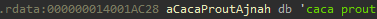
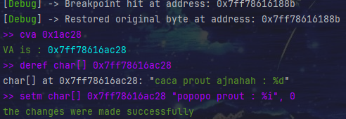
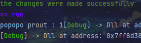
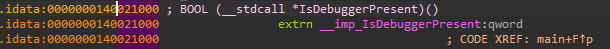
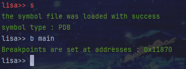
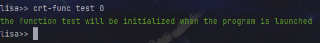
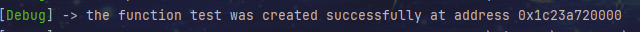
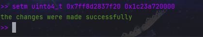
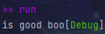

# LisaDbg
it's a rust dbg,currently it only works for x64 programs, but this will most likely change in the future,
it has a small cli interface but the vast majority of available commands are in the context of the app, 
# here is the cli interface :

```
FLAGS:
    -h, --help       Prints help information
    -V, --version    Prints version information

OPTIONS:
    -a, --arg <arg>                          set arguments for script to debug
    -b, --breakpoint <breakpoint-addr>...    to place a breakpoint at an address (RVA)
    -f, --file <file>                        to select a file
```

As you can see, the options here are limited, 

here are all the commands available before debugging begins (you can access them by typing "help" in the entry at the beginning):
# before dbg
```
LisaDbg Help:
Available commands:
    breakpoint, b                         Sets a breakpoint at the specified address (rva) or symbol
    retain-breakpoint, rb                 Remove a breakpoint with its RVA address
    file                                  Change the current file context
    run                                   Start or resume execution of the debugged program
    reset                                 Reset the debugger settings or context
    quit, q, exit                         Exit the debugger
    s, sym, symbol                        Load symbols, this will allow commands like "stret" to be used with the function name directly
    stret                                 places a breakpoint at each ret of the specified function
    skip                                  skip calls to the specified function
    hook, ho                              Setup a function hook to redirect execution flow
    dret                                  removes the specified function from the "stret" field
    dskip                                 removes the specified function from the "skip" field
    create-func, crt-func                 Create a custom function with a return value allocated at execution
    view                                  see certain information like the breakpoints that have been placed etc
    help, h                               Display this help message

For detailed usage, just type <command> without its arguments
```

you should know that here, these are not all the debugger options, just the pre-debugging options,

if you put a breakpoint at an address and the dbg stops, you will be able to execute all these commands :
# in dbg
```
>> help

Available commands:

   c, continue, run            : Continue the execution of the process
   v, value                    : Display the value of a specified register
   deref                       : Dereference the value at a specific memory address or register in the target process
   setr, setreg                : Set a new value to a specified register
   q, quit, break              : Terminate the debugging session. Confirmation required
   base-addr, ba               : Display the base address of the target process
   setm, setmemory             : Defined a new value at the specified memory address (va) or at the specified register (the register value will be considered as address)
   b, breakpoint               : Set a breakpoint at the specified address (rva) or symbol
   rb                          : Restore the byte at the specified address (rva) that was overwritten by a breakpoint
   reset                       : Reset the state of the debugging session
   cva                         : Calculates the va of a specified rva
   b-sp                        : Display the stack pointer (rsp) value at the beginning of the function (only if the function had been specified with stret)
   ret-addr, raddr             : Display the return address of the current function (only if the function had been specified with stret)
   ret                         : Set the instruction pointer (rip) to the return address of the current function and decrement the stack pointer (rsp) by 8 (only if the function had been specified with stret)
   skip                        : skip calls to the specified function
   stret                       : places a breakpoint at each ret of the specified function
   dret                        : removes the specified function from the "stret" field
   dskip                       : removes the specified function from the "skip" field
   view                        : see certain information like the breakpoints that have been placed etc
   disasm                      : to disassemble opcodes from a specified address (va)
   help                        : Display this help message


for more information (if available) just type <command> without its arguments
```
the debugger already removes all memory protections, so you can write to memory areas that are e.g. read-only
# examples :
we have a string in the .rdata (a section which is supposed to store constant data), here it is : 



if we modify the bytes at this location like this:





we can see that it displays well: 




features like breakpoints, hooks etc do not work for imported functions (for the moment), but you can manually manipulate the addresses stored in them to redirect the input to your custom function

we can see that at address 0x21000 we have an entry :





we will now add a breakpoint to the 'main' function like this :



we are now going to create a function with a custom return value like this :
 



when we run the programm we can clearly see that the function has been successfully created ! 



we can now see that when we calculate the va with the rva of iat entry and we dereference the value uint64_t at this address (va) we obtain :


now we are going to change the value at this address to place the address of our function (that was previously 0x1c23a720000) : 




now if we continue execution of the programm we can see that the ret value is 0 and that it displays the message :




this is a stupid example but it proves that it works lol
